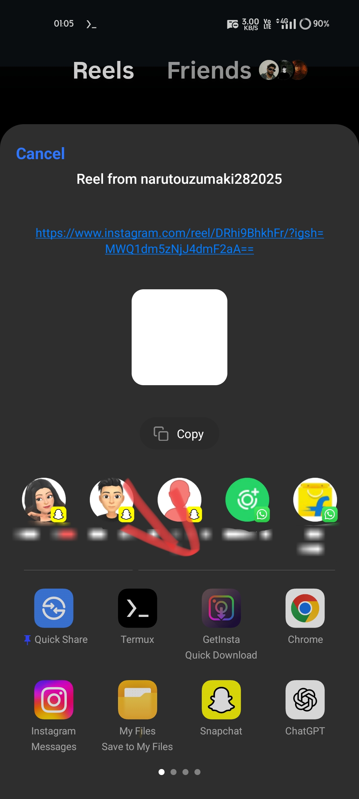

# GetInsta - Universal Media Downloader

<div align="center">


**A powerful, secure, and user-friendly Flutter application for downloading media from Instagram, YouTube, and Pinterest**

[](https://flutter.dev/)
[](https://dart.dev/)
[](https://android.com/)
[](LICENSE)
[](https://github.com/hiotakuofficial-cloud/GetInsta/releases)

</div>

## 📱 App Screenshots

<div align="center">

### 🏠 Main Interface




### 📊 Management & Info


</div>

## ✨ Key Features

### 🎯 **Multi-Platform Download Support**
- **📸 Instagram**: Posts, Reels, Stories, IGTV videos with high quality
- **🎥 YouTube**: Videos (360p-720p), Audio (128kbps-320kbps), Playlists support
- **📌 Pinterest**: Images, Videos, GIFs with original quality preservation
- **⚡ Quick Download**: One-tap downloads with smart quality selection

### 🚀 **Advanced Functionality**
- **🔍 Smart URL Detection**: Automatically identifies platform and content type
- **📦 Batch Downloads**: Handle multiple media files from carousel posts
- **🔄 Background Processing**: Downloads continue when app is minimized
- **📤 Share Integration**: Direct downloads from other apps via share menu
- **📋 Download Manager**: Complete history with search and filter options
- **🎮 Built-in Video Player**: Preview downloaded videos without leaving app
- **💾 Smart Caching**: Efficient memory management and duplicate prevention

### 🔒 **Enterprise-Grade Security**
- **🔐 Encrypted API Communication**: Advanced token obfuscation system
- **🛡️ Zero Data Collection**: Complete privacy protection
- **🔒 Secure Headers**: Industry-standard security protocols
- **💽 Local-Only Storage**: All data remains on your device
- **🚫 No Tracking**: No analytics or user behavior monitoring

### 🎨 **Premium User Experience**
- **🌙 Material Design 3**: Modern, adaptive interface with dark theme
- **📊 Real-time Progress**: Live download indicators with speed metrics
- **🔔 Smart Notifications**: Contextual feedback for all operations
- **⚠️ Intelligent Error Handling**: User-friendly error messages with solutions
- **🎯 Gesture Navigation**: Intuitive swipe and tap interactions
- **🔄 Auto-Updates**: Background update checking system

## 🏗️ Technical Architecture

### **Frontend Stack**
- **Framework**: Flutter 3.0+ with Dart 3.0+
- **UI Library**: Material Design 3 Components
- **State Management**: Efficient StatefulWidget architecture
- **Navigation**: Flutter Navigator 2.0 with deep linking
- **Media Handling**: Advanced video/audio processing

### **Backend Integration**
- **API Design**: RESTful architecture with secure endpoints
- **Authentication**: Token-based security with encryption
- **Network Layer**: Custom HTTP client with retry logic
- **Compression**: Smart response handling (gzip/identity)
- **Caching**: Multi-layer caching strategy

### **Native Integration**
- **Android Services**: Kotlin-based background processing
- **File System**: Secure storage with permission management
- **Intent Handling**: Deep links and share intent processing
- **Notifications**: Rich notification system with actions

## 📋 System Requirements

### **Minimum Requirements**
- **OS**: Android 5.0 (API 21) or higher
- **RAM**: 2GB minimum, 4GB recommended
- **Storage**: 100MB app size + download space
- **Network**: Stable internet connection (WiFi/Mobile data)

### **Recommended Specifications**
- **OS**: Android 8.0+ for optimal performance
- **RAM**: 4GB+ for smooth multitasking
- **Storage**: 1GB+ free space for downloads
- **Network**: High-speed connection for faster downloads

## 🚀 Installation Guide

### **📱 Quick Install (Recommended)**
1. **Download**: Get the latest APK from [Releases](https://github.com/hiotakuofficial-cloud/GetInsta/releases)
2. **Enable**: Allow "Install from Unknown Sources" in Settings
3. **Install**: Tap the APK file and follow prompts
4. **Permissions**: Grant storage and network permissions
5. **Ready**: Start downloading your favorite content!

### **🛠️ Developer Build**
```bash
# Prerequisites: Flutter SDK, Android Studio, Git

# Clone repository
git clone https://github.com/hiotakuofficial-cloud/GetInsta.git
cd GetInsta

# Install dependencies
flutter pub get

# Run on device/emulator
flutter run

# Build release APK
flutter build apk --release --split-per-abi
```

## 📖 Complete Usage Guide

### **🎯 Basic Download Workflow**
1. **📋 Copy URL**: Copy media link from Instagram/YouTube/Pinterest
2. **📱 Open GetInsta**: Launch the app and paste URL in input field
3. **⚙️ Select Options**: Choose quality, format, or use quick download
4. **⬇️ Download**: Tap download button and monitor progress
5. **📁 Access Files**: Find media in `/Download/reel/` folder
6. **▶️ Play/View**: Use built-in player or gallery app

### **⚡ Advanced Features**
- **🔄 Batch Processing**: Paste multiple URLs (one per line)
- **📤 Share Integration**: Share URLs directly from other apps
- **🎵 Audio Extraction**: Download YouTube videos as MP3 files
- **📊 Quality Selection**: Choose from multiple resolution options
- **🔍 Smart Search**: Find downloads in history with search
- **🗂️ File Management**: Organize downloads with smart naming

### **🎮 Video Player Features**
- **▶️ Full Controls**: Play, pause, seek, volume control
- **🔄 Repeat Mode**: Loop videos for continuous playback
- **📱 Orientation**: Auto-rotate for landscape viewing
- **⏩ Speed Control**: Adjust playback speed (0.5x - 2x)
- **📋 Playlist**: Queue multiple videos for continuous play

## ⚙️ Advanced Configuration

### **📁 Storage Settings**
- **Default Path**: `/storage/emulated/0/Download/reel/`
- **Custom Folders**: Organize by platform or date
- **Naming Convention**: `{platform}_{username}_{timestamp}.{ext}`
- **Duplicate Handling**: Auto-rename with incremental numbers

### **🔒 Security Configuration**
- **Token Rotation**: Automatic security token refresh
- **Request Headers**: Browser-like headers for anonymity
- **SSL/TLS**: Encrypted communication channels
- **Local Encryption**: Sensitive data encrypted at rest

### **🎛️ Performance Tuning**
- **Concurrent Downloads**: Up to 3 simultaneous downloads
- **Cache Management**: Automatic cleanup of temporary files
- **Memory Optimization**: Efficient image/video processing
- **Battery Optimization**: Smart background processing

## 🤝 Contributing to GetInsta

We welcome contributions from developers worldwide! Here's how to get started:

### **🚀 Quick Start for Contributors**
1. **🍴 Fork**: Fork the repository to your GitHub account
2. **📥 Clone**: `git clone https://github.com/yourusername/GetInsta.git`
3. **🌿 Branch**: `git checkout -b feature/your-amazing-feature`
4. **💻 Code**: Implement your feature with proper documentation
5. **✅ Test**: Ensure all tests pass and add new ones if needed
6. **📝 Commit**: `git commit -m 'Add amazing feature'`
7. **📤 Push**: `git push origin feature/your-amazing-feature`
8. **🔄 PR**: Open a Pull Request with detailed description

### **📋 Development Standards**
- **Code Style**: Follow Flutter/Dart official style guide
- **Documentation**: Comment complex logic and public APIs
- **Testing**: Maintain test coverage above 80%
- **Security**: Follow OWASP mobile security guidelines
- **Performance**: Profile and optimize resource usage

### **🎯 Areas for Contribution**
- **🌐 Localization**: Add support for more languages
- **🎨 UI/UX**: Improve interface design and user experience
- **⚡ Performance**: Optimize download speeds and memory usage
- **🔧 Features**: Add support for new platforms or formats
- **🐛 Bug Fixes**: Identify and resolve issues
- **📚 Documentation**: Improve guides and API documentation

## 🛠️ Troubleshooting

### **Common Issues & Solutions**

**❌ Download Fails**
- ✅ Check internet connection
- ✅ Verify URL is valid and public
- ✅ Ensure sufficient storage space
- ✅ Try different quality settings

**❌ App Crashes**
- ✅ Update to latest version
- ✅ Clear app cache and data
- ✅ Restart device
- ✅ Check available RAM

**❌ Permission Denied**
- ✅ Grant storage permissions in Settings
- ✅ Enable "Install from Unknown Sources"
- ✅ Check folder write permissions

## 📄 License & Legal

This project is licensed under the **MIT License** - see the [LICENSE](LICENSE) file for complete details.

### **⚖️ Important Legal Notes**
- **Fair Use**: This app is for personal use and educational purposes
- **Content Rights**: Users are responsible for respecting copyright laws
- **Platform Terms**: Ensure compliance with platform terms of service
- **No Liability**: Developers are not responsible for misuse of the application

## 🙏 Acknowledgments & Credits

### **🏆 Special Thanks**
- **Flutter Team**: For the incredible cross-platform framework
- **Material Design**: For the beautiful and accessible design system
- **Open Source Community**: For inspiration, libraries, and support
- **Beta Testers**: For valuable feedback and bug reports
- **Contributors**: For code contributions and improvements

### **📚 Third-Party Libraries**
- **HTTP Package**: For network requests
- **Path Provider**: For file system access
- **Flutter Toast**: For user notifications
- **Video Player**: For media playback
- **Permission Handler**: For runtime permissions

## 📞 Support & Community

### **🆘 Get Help**
- **🐛 Bug Reports**: [GitHub Issues](https://github.com/hiotakuofficial-cloud/GetInsta/issues)
- **💬 Discussions**: [GitHub Discussions](https://github.com/hiotakuofficial-cloud/GetInsta/discussions)
- **📧 Email Support**: [support@getinsta.app](mailto:support@getinsta.app)
- **📖 Documentation**: [Wiki Pages](https://github.com/hiotakuofficial-cloud/GetInsta/wiki)

### **🌟 Community Guidelines**
- **🤝 Be Respectful**: Treat all community members with respect
- **📝 Be Descriptive**: Provide detailed information in issues/PRs
- **🔍 Search First**: Check existing issues before creating new ones
- **📚 Follow Templates**: Use provided issue and PR templates

## 🔄 Version History & Roadmap

### **📈 Current Version: v1.0.0**
- ✅ Multi-platform support (Instagram, YouTube, Pinterest)
- ✅ Advanced security implementation with token obfuscation
- ✅ Background download services with notifications
- ✅ Material Design 3 interface with dark theme
- ✅ Comprehensive error handling and user feedback
- ✅ Smart caching system and duplicate prevention
- ✅ Built-in video player with full controls
- ✅ Download history with search and management

### **🚀 Upcoming Features (v1.1.0)**
- 🔄 **TikTok Support**: Download TikTok videos and audio
- 🌐 **Multi-Language**: Support for 10+ languages
- ☁️ **Cloud Sync**: Backup download history to cloud
- 🎨 **Custom Themes**: Multiple theme options
- 📱 **Tablet UI**: Optimized interface for tablets
- 🔔 **Smart Notifications**: Advanced notification system

### **🎯 Long-term Roadmap**
- **Desktop Version**: Windows, macOS, Linux support
- **Batch URLs**: Import URLs from files
- **Scheduled Downloads**: Download at specific times
- **Quality Presets**: Save preferred quality settings
- **Advanced Filters**: Filter content by type, size, date

---

<div align="center">

**🎉 Made with ❤️ by the GetInsta Development Team**

[](https://github.com/hiotakuofficial-cloud/GetInsta/stargazers)
[](https://github.com/hiotakuofficial-cloud/GetInsta/network/members)
[](https://github.com/hiotakuofficial-cloud/GetInsta/issues)

**⭐ Star this repository if you found it helpful!**

</div>
