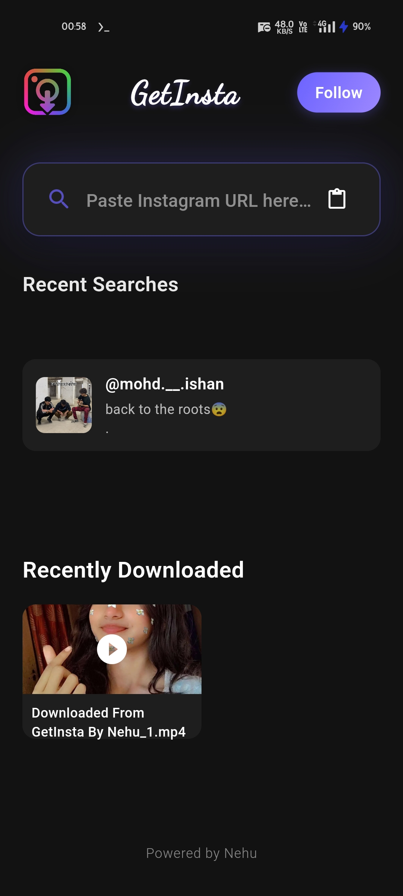
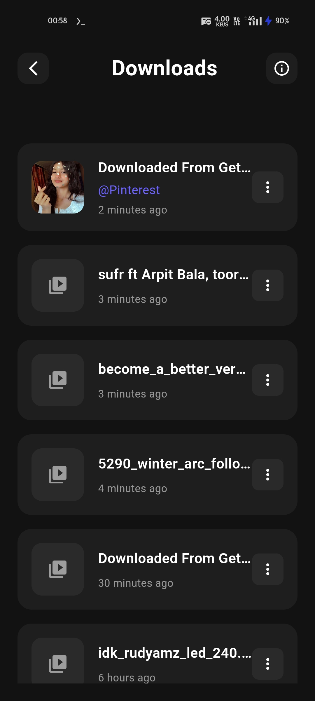
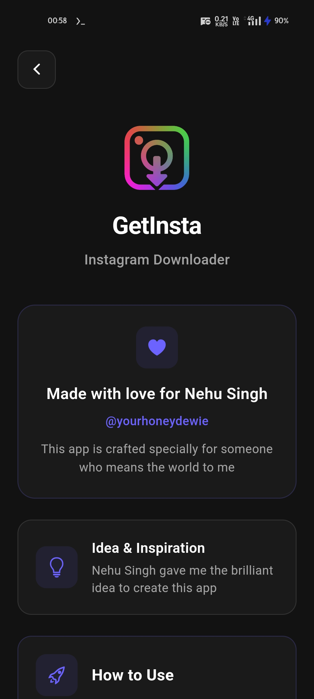

# GetInsta - Universal Media Downloader

<div align="center">


**A powerful, secure, and user-friendly Flutter application for downloading media from Instagram, YouTube, and Pinterest**

[](https://flutter.dev/)
[](https://dart.dev/)
[](https://android.com/)
[](LICENSE)

</div>

## 📱 Screenshots

<div align="center">
  
  
  
</div>

## ✨ Features

### 🎯 **Multi-Platform Support**
- **Instagram**: Download posts, reels, stories, and IGTV videos
- **YouTube**: Download videos in multiple qualities (360p, 480p, 720p) and audio (128kbps, 320kbps)
- **Pinterest**: Download images and videos with smart format detection

### 🚀 **Advanced Functionality**
- **Smart URL Detection**: Automatically identifies platform and content type
- **Batch Downloads**: Handle multiple media files from single posts
- **Background Downloads**: Continue downloads when app is minimized
- **Share Integration**: Download directly from other apps via share intent
- **Download History**: Track and manage all downloaded content
- **Smart Caching**: Efficient memory management and caching system

### 🔒 **Security & Privacy**
- **Encrypted API Tokens**: Advanced obfuscation and security measures
- **No Data Collection**: Your privacy is our priority
- **Secure Headers**: Industry-standard security protocols
- **Local Storage**: All data stored locally on your device

### 🎨 **User Experience**
- **Material Design 3**: Modern, intuitive interface
- **Dark Theme**: Eye-friendly design
- **Real-time Progress**: Live download progress indicators
- **Toast Notifications**: Instant feedback for all operations
- **Error Handling**: Comprehensive error management with user-friendly messages

## 🛠️ Technical Architecture

### **Frontend**
- **Framework**: Flutter 3.0+ with Dart
- **UI Components**: Material Design 3
- **State Management**: StatefulWidget with efficient rebuilds
- **Navigation**: Flutter Navigator 2.0

### **Backend Integration**
- **API Architecture**: RESTful APIs with secure token authentication
- **Network Layer**: HTTP client with custom headers and compression handling
- **Error Handling**: Comprehensive exception management
- **Caching**: Intelligent local caching system

### **Platform Integration**
- **Android**: Native Kotlin services for background operations
- **File Management**: Secure file system operations
- **Permissions**: Runtime permission handling
- **Intents**: Deep linking and share intent support

## 📋 Requirements

- **Android**: 5.0 (API level 21) or higher
- **Storage**: 50MB free space
- **Internet**: Active internet connection
- **Permissions**: Storage access for downloads

## 🚀 Installation

### **Option 1: Download APK**
1. Download the latest APK from [Releases](https://github.com/hiotakuofficial-cloud/GetInsta/releases)
2. Enable "Install from Unknown Sources" in Android settings
3. Install the APK file
4. Grant required permissions

### **Option 2: Build from Source**
```bash
# Clone the repository
git clone https://github.com/hiotakuofficial-cloud/GetInsta.git

# Navigate to project directory
cd GetInsta

# Install dependencies
flutter pub get

# Build APK
flutter build apk --release
```

## 📖 Usage Guide

### **Basic Download Process**
1. **Copy URL**: Copy the media URL from Instagram, YouTube, or Pinterest
2. **Paste in App**: Open GetInsta and paste the URL
3. **Select Quality**: Choose your preferred quality (for YouTube)
4. **Download**: Tap download and wait for completion
5. **Access Files**: Find downloaded files in `/Download/reel/` folder

### **Advanced Features**
- **Quick Download**: Use the lightning bolt icon for instant downloads
- **Batch Processing**: Paste multiple URLs separated by new lines
- **Background Mode**: Downloads continue even when app is closed
- **Share Integration**: Share URLs directly to GetInsta from other apps

## 🔧 Configuration

### **Download Settings**
- **Default Quality**: 360p for videos, original for images
- **Storage Location**: `/storage/emulated/0/Download/reel/`
- **File Naming**: Smart naming based on content and timestamp
- **Duplicate Handling**: Automatic file renaming to prevent overwrites

### **Security Features**
- **Token Obfuscation**: API tokens are encrypted and obfuscated
- **Secure Headers**: All requests use secure, browser-like headers
- **No Logging**: No sensitive data is logged or stored

## 🤝 Contributing

We welcome contributions! Please follow these steps:

1. **Fork** the repository
2. **Create** a feature branch (`git checkout -b feature/AmazingFeature`)
3. **Commit** your changes (`git commit -m 'Add some AmazingFeature'`)
4. **Push** to the branch (`git push origin feature/AmazingFeature`)
5. **Open** a Pull Request

### **Development Guidelines**
- Follow Flutter/Dart style guidelines
- Add comments for complex logic
- Test on multiple Android versions
- Ensure security best practices

## 📄 License

This project is licensed under the MIT License - see the [LICENSE](LICENSE) file for details.

## 🙏 Acknowledgments

- **Flutter Team**: For the amazing framework
- **Material Design**: For the beautiful design system
- **Open Source Community**: For inspiration and support
- **Beta Testers**: For valuable feedback and bug reports

## 📞 Support

- **Issues**: [GitHub Issues](https://github.com/hiotakuofficial-cloud/GetInsta/issues)
- **Discussions**: [GitHub Discussions](https://github.com/hiotakuofficial-cloud/GetInsta/discussions)
- **Email**: [Support Email](mailto:support@getinsta.app)

## 🔄 Changelog

### **v1.0.0** (Latest)
- ✅ Multi-platform support (Instagram, YouTube, Pinterest)
- ✅ Advanced security implementation
- ✅ Background download services
- ✅ Material Design 3 interface
- ✅ Comprehensive error handling
- ✅ Smart caching system

---

<div align="center">

**Made with ❤️ by the GetInsta Team**

[](https://github.com/hiotakuofficial-cloud/GetInsta/stargazers)
[](https://github.com/hiotakuofficial-cloud/GetInsta/network/members)

</div>
